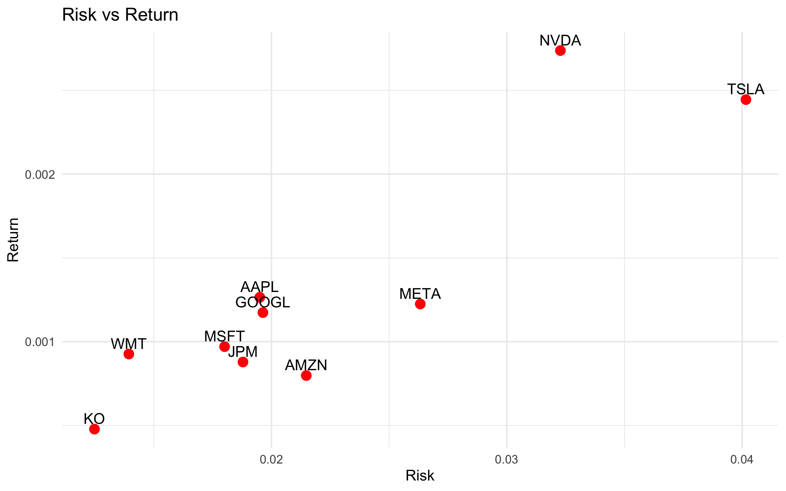
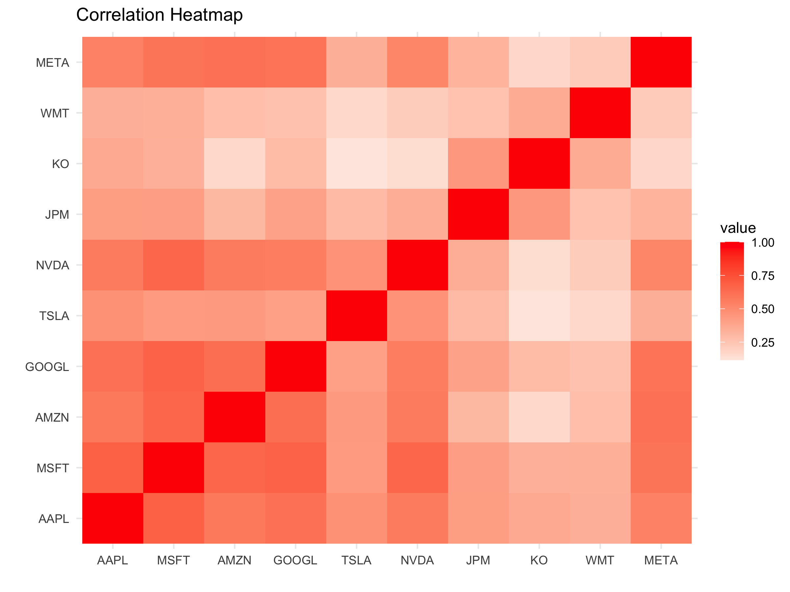
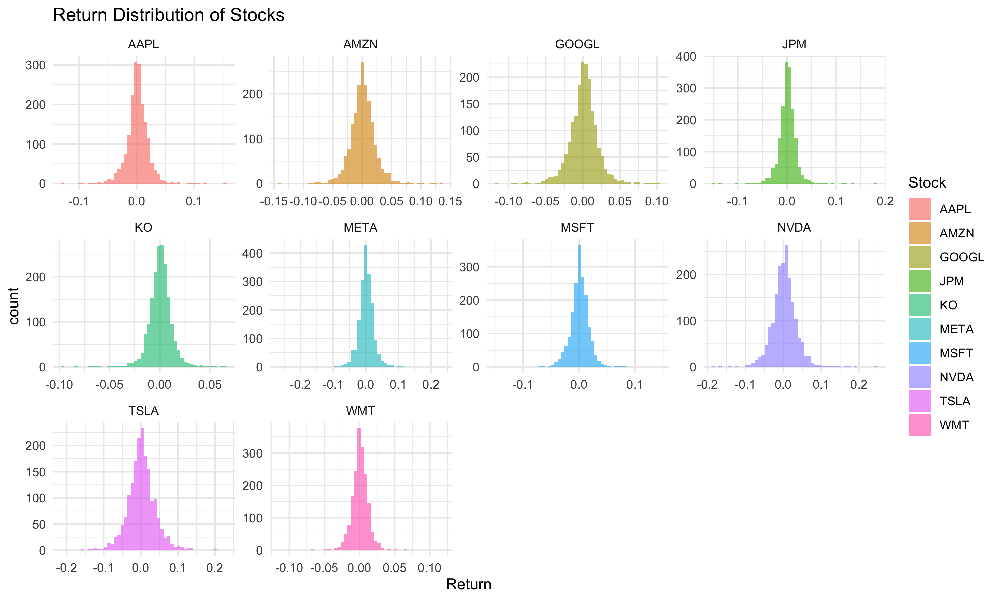
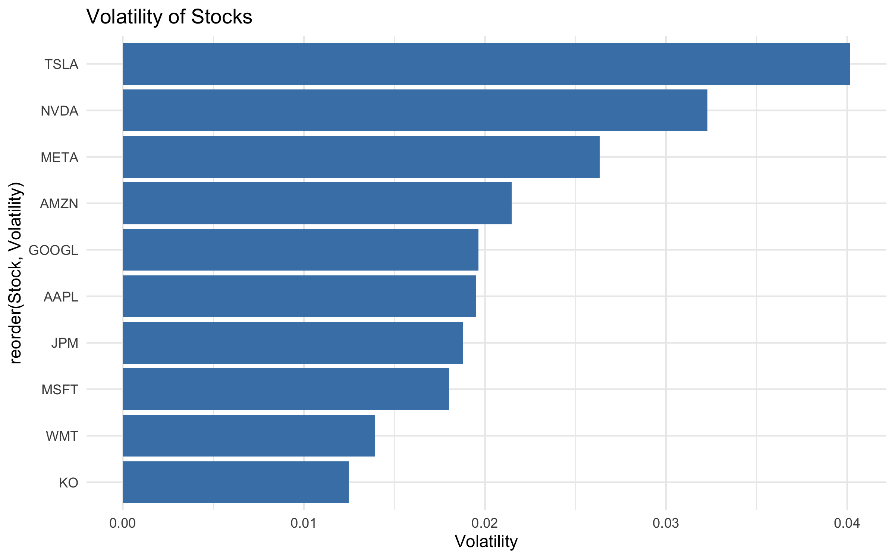
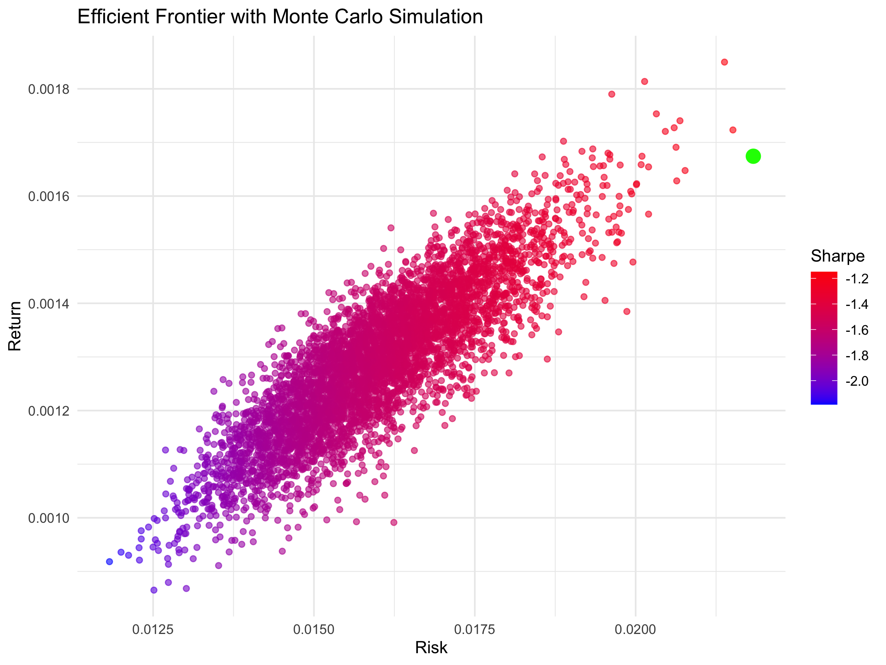
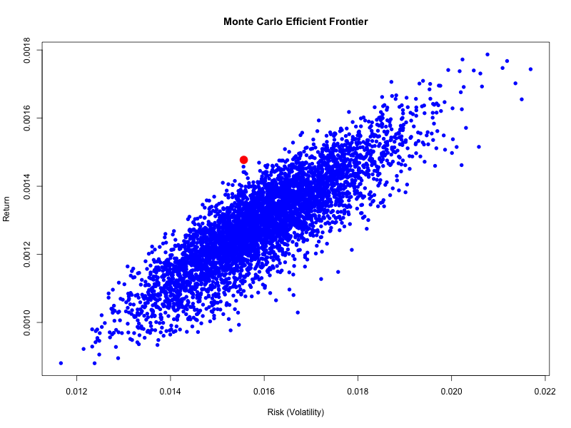
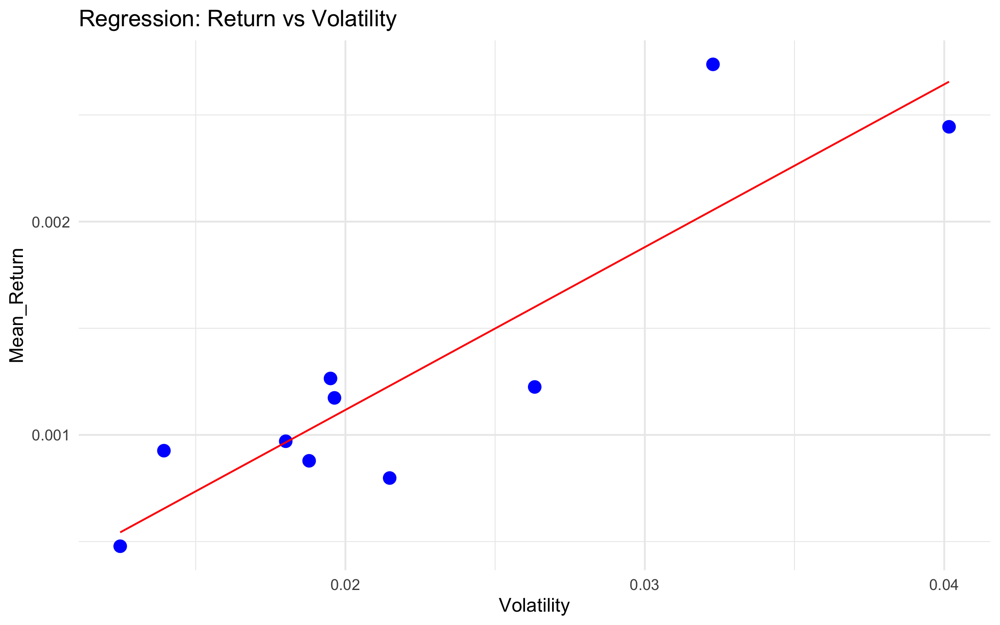
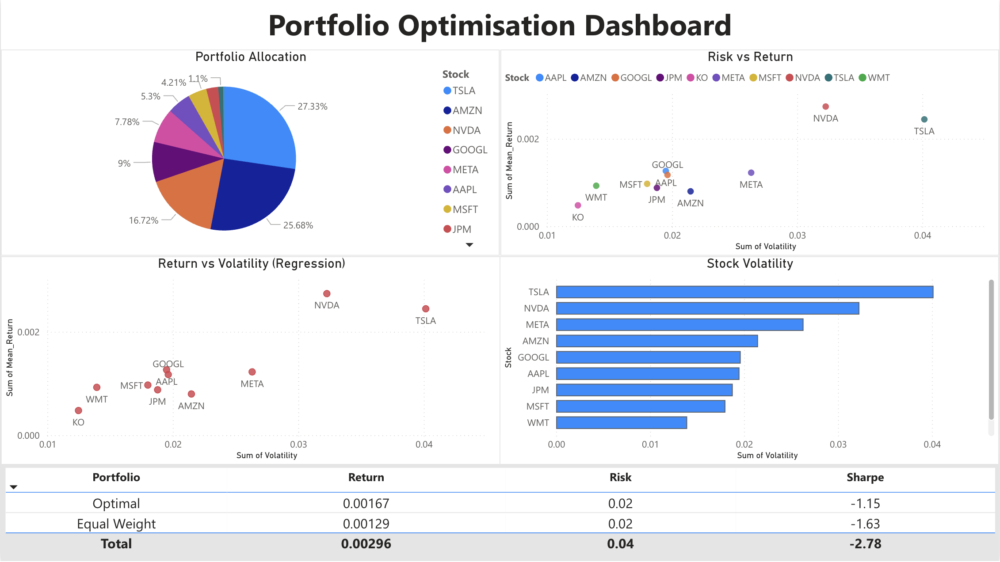

📊 Algorithmic Portfolio Optimisation (R + Power BI)

🚀 Overview

This project builds an **end-to-end financial analytics system** for portfolio optimisation using real-world stock market data.

It integrates:

* Data ingestion from APIs
* Data preprocessing
* Exploratory Data Analysis (EDA)
* Predictive modelling
* Portfolio optimisation
* Monte Carlo simulation
* Interactive Power BI dashboard


 🎯 Problem Statement

To construct an optimal investment portfolio that **maximizes return while minimizing risk** using quantitative techniques.


 📊 Data Sources

* **Yahoo Finance API** → Stock prices
* **FRED API** → Risk-free rate (3-Month Treasury Bill)

---

⚙️ Project Workflow

1️⃣ Data Ingestion (`api_ingestion.R`)

* Fetch stock data using `quantmod`
* Fetch risk-free rate using `fredr`
* Store datasets locally

---

2️⃣ Data Preprocessing (`preprocessing.R`)

* Clean stock data
* Compute **daily returns**
* Transform data into analysis-ready format

---

3️⃣ Exploratory Data Analysis (`eda.R`)

* Return distribution
* Correlation analysis
* Risk vs Return analysis
* Volatility comparison

---

📊 EDA Visualisations

📈 Risk vs Return



📊 Correlation Heatmap



📉 Return Distribution



📊 Volatility Comparison



 4️⃣ Portfolio Optimisation (`optimisation.R`)

* Mean-Variance Optimization
* Efficient Frontier
* Optimal portfolio weights

📈 Efficient Frontier



---

5️⃣ Monte Carlo Simulation (`monte_carlo.R`) 🔥

* Generated **5000+ random portfolios**
* Calculated:

  * Return
  * Risk
  * Sharpe Ratio
* Selected best portfolio using **maximum Sharpe ratio**

📈 Monte Carlo Efficient Frontier



---

6️⃣ Predictive Modelling (`evaluation.R`)

* Linear Regression: Return vs Volatility
* Model evaluation using RMSE

📈 Regression Plot



---

📊 Power BI Dashboard

The interactive dashboard includes:

* Portfolio Allocation
* Risk vs Return
* Volatility Comparison
* Regression Insights
* Portfolio Comparison
* KPI Metrics (Return, Risk, Sharpe Ratio)

🖥️ Dashboard Preview



---

## 📂 Project Structure

```text
ALGORITHMIC-PORTFOLIO-OPTIMISATION-R/
│
├── data/
│   ├── stock_prices.csv
│   ├── stock_returns.csv
│   ├── risk_free_rate.csv
│   ├── optimal_weights.csv
│   ├── portfolio_comparison.csv
│   ├── regression_results.csv
│   ├── monte_carlo_results.csv
│   └── monte_carlo_best.csv
│
├── scripts/
│   ├── api_ingestion.R
│   ├── preprocessing.R
│   ├── eda.R
│   ├── optimisation.R
│   ├── monte_carlo.R
│   └── evaluation.R
│
├── visuals/
│   ├── risk_return.png
│   ├── correlation_heatmap.png
│   ├── return_distribution.png
│   ├── volatility.png
│   ├── efficient_frontier.png
│   ├── monte_carlo_frontier.png
│   └── regression_plot.png
│
├── powerbi/
│   ├── dashboard.pbix
│   └── dashboard.png
│
├── README.md
├── .gitignore
└── .env
```

---

## 🛠️ Technologies Used

* **R** (tidyverse, quantmod, PerformanceAnalytics)
* **Power BI**
* **Yahoo Finance API**
* **FRED API**

---

## 📌 Key Concepts

* Modern Portfolio Theory
* Efficient Frontier
* Sharpe Ratio
* Risk & Return Analysis
* Monte Carlo Simulation
* Regression Modelling

---

## 🎯 Results

* Identified optimal portfolio allocation
* Improved risk-adjusted performance
* Validated results using Monte Carlo simulation
* Built an interactive dashboard for decision-making

---

## 🚀 Future Improvements

* Real-time data integration
* More assets (ETF, crypto)
* Advanced ML models

---

## 👨‍💻 Author

**Laksh Raj**
B.Tech Computer Science (Data Science)

---

## ⭐ If you like this project

Give it a star ⭐ on GitHub!


